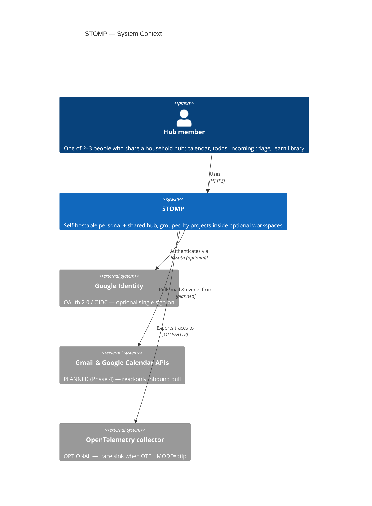
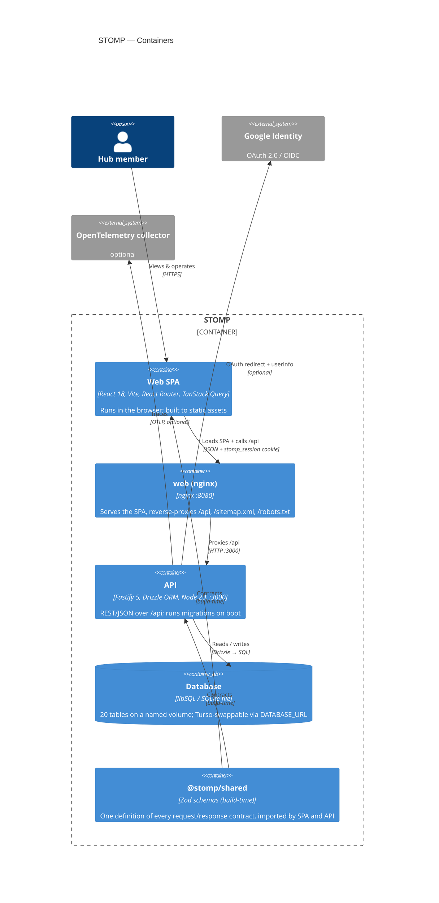
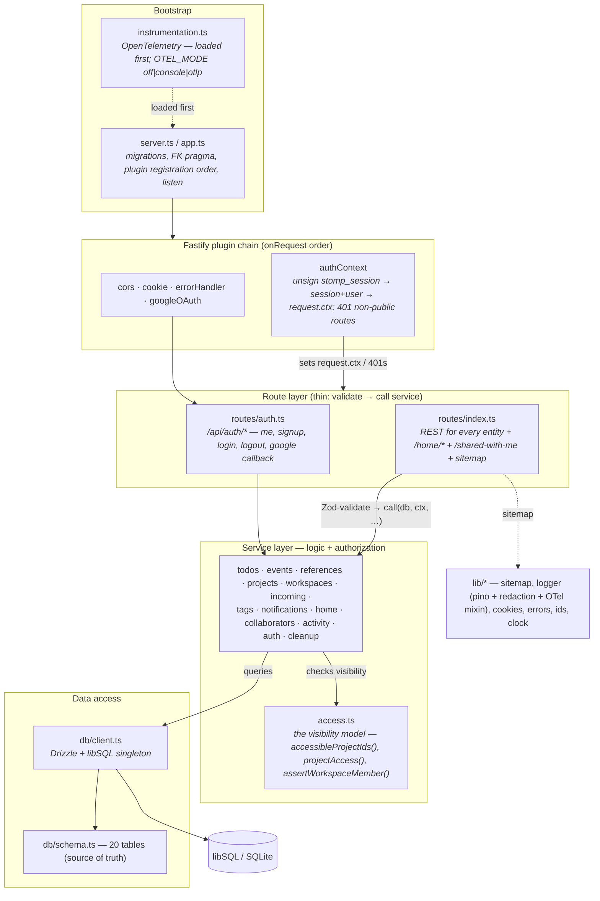
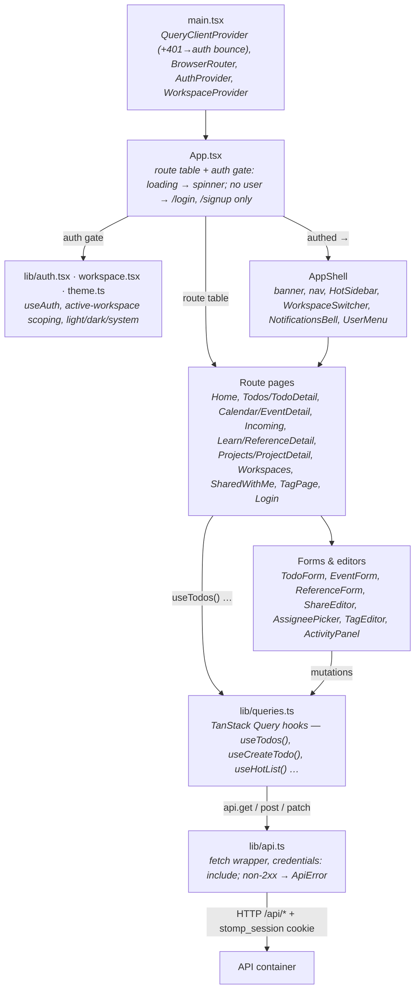
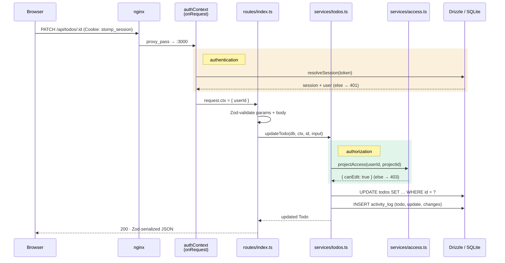

# STOMP — C4 model

The architecture at four zoom levels ([C4 model](https://c4model.com/): Context → Container
→ Component → Code). This file is the tracked, diffable source; the same model is also an
**interactive click-through page** — [`c4-model.html`](c4-model.html) — with pan/zoom and
drill-down. The web app serves a copy at **`/architecture.html`** (generated from this file by
`apps/web` prebuild; linked from the app footer).

Current as of **v0.4.0** (Phases 0–3 on `main`). Update this file and `c4-model.html` together
when a top-level piece is added or its responsibility changes.

Legend: **planned** = designed, not built (Phase 4 integrations). **optional** = present but
off/absent unless configured (Google OAuth, OpenTelemetry).

---

## Level 1 — System Context

- The member works entirely in a browser.
- Google Identity is a no-op until `GOOGLE_CLIENT_ID`/`GOOGLE_CLIENT_SECRET` are set;
  email/password auth works regardless.
- Gmail/Calendar sync is designed (`integration_accounts`, `sync_log` tables exist) but not
  implemented.

---

## Level 2 — Containers (inside STOMP)

- **Local dev** replaces nginx: Vite serves the SPA on `:5173` and proxies `/api` to Fastify on
  `:3000`; the DB is `apps/api/.data/stomp.db`.
- **Container**: `docker compose up` starts `web` + `api`; the DB is a file on the `stomp-data`
  volume. Prod requires `SESSION_SECRET`; seeding prod requires `SEED_USER_PASSWORD`.
- Dependency direction: `web → shared ← api`. `web` never imports from `api`.

---

## Level 3 — Components: the API container

- Every service function is `(db, ctx, …)`. Adding real auth in Phase 3 changed only
  `authContext` — services and data access were untouched.
- Hard delete + an `activity_log` row on every mutation (resolved A5). `services/cleanup.ts`
  purges polymorphic references (`taggings`, notification/inbox back-links) on delete.

---

## Level 3 — Components: the Web SPA

- Forms use the same Zod schemas the API validates against (`@stomp/shared`).
- A 401 from any query invalidates `["auth","me"]`, which flips `App.tsx` to the login screen.

---

## Level 4 — Code: one request end to end

`PATCH /api/todos/:id` — editing a todo. The **authentication** gate is the session lookup;
the **authorization** gate is `projectAccess`.

Public routes (health, `/api/auth/*`, `sitemap.xml`, `robots.txt`) skip the `request.ctx` set /
401 in `authContext`. `AUTH_TEST_BYPASS=true` makes the test suites run as the seed user.
